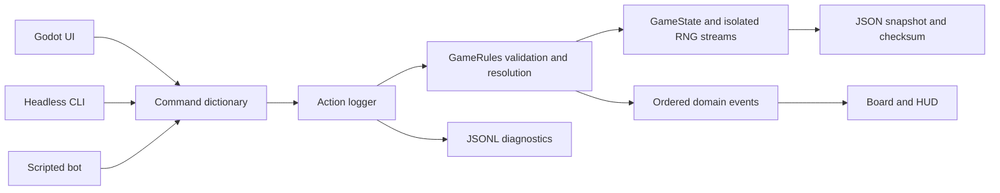

# Architecture

## One authoritative model

`scripts/domain/game_rules.gd` owns a `GameState` and deterministic RNG. Both are `RefCounted` objects without scene-tree dependencies. Immutable definitions load from JSON under `data/`; runtime state contains JSON-safe primitives, dictionaries, arrays, and stable IDs. No renderer transform or Node instance identifies a gameplay entity.

`GameRules.execute(command)` validates a proposed intent, returns a stable reason code on rejection, or mutates state and emits ordered domain events on acceptance. Rejections must leave the full checksum, RNG, history and version unchanged. `legal_actions(player_id)` uses the same resolvers to return legal options, weighted paths and costs; it is a read-only query.

## Domain modules

- `domain/hex/hex.gd`: pointy-top axial/cube geometry, deterministic coordinate queries and world projection.
- `domain/generation/`: structured seeded generation and fairness/connectivity validation, including bounded retries and diagnostics.
- `domain/resolvers/movement.gd`: weighted movement with occupied-hex blocking, terminal swamps, Ranger Forest cost, and separate all-road and mixed-path states.
- `domain/resolvers/combat.gd`: pure, data-driven stance and damage arithmetic; no resource mutation or RNG draws.
- `domain/resolvers/battle_flow.gd` and `class_flow.gd`: explicit combat, Fate, displacement, Bribe and Challenge windows; prepared class effects and movement interruption.
- `domain/resolvers/economy.gd`, `equipment.gd`, `exploration.gd`, `world_events.gd`, and `victory.gd`: Settlement networks and Trade, purchases/effects, revealed reward choices, timed world changes, public claims and rituals.
- `domain/bots/simple_bot.gd`: deterministic policy over legal actions, public stats and discovered locations. It never inspects opponents' sealed stances or plans and does not draw gameplay RNG.
- `domain/bots/objective_policy.gd`: public victory goals, road obstructions, Relic pursuit, discovery frontiers and nearby claim interference.
- `domain/definitions/`: validated class, rule, monster and tower-trait data; combat loads its stance table from JSON.
- `domain/state/`: portable state, schema/definition validation and canonical checksums.
- `domain/commands/` and `domain/events/`: stable intent/result/event foundations.
- `services/deterministic_rng.gd`: named PRNG streams with serializable state and draw indices.

Gameplay RNG streams are derived from the master seed and isolated from one another. Presentation never draws from them. Initiative and tie results record stream, draw index, range and result in events. State hashing recursively sorts dictionary keys and normalizes integral JSON numbers, so a JSON round trip cannot change a checksum merely by representing integers as floats.

## Clients and diagnostics

The native presentation creates board meshes and Controls from snapshots, submits commands, then animates emitted changes. Logic commits before animation, so interrupting a tween cannot change the result.

`tools/realm.mjs` handles argument parsing, process invocation, locks and filesystem persistence. It writes JSON request/response files and launches `tools/game_cli.gd` with a literal argument array, avoiding shell interpretation of player input. That GDScript adapter uses the same `GameRules`, legal queries and `SimpleBot.choose(rules)` policy as other clients. The bot handles required decisions before scheduled actions, then pursues class-favored victory goals. Simulations stop on an actual model victory or configured limit; they never invent a winner. Per-round command bounds and invalid-calculation checks surface stalls promptly. `tools/match_simulation.gd` runs fresh games and replays accepted history for the 25-match regression report.

`ActionLogger.execute` wraps the command boundary for native UI, CLI and the network host. Each accepted or rejected attempt records the complete command, source, reason, before/after checksums and versions, phase, pending-decision stage, RNG snapshots, and emitted events. UTC timestamps and durations exist only in diagnostics; they are excluded from authoritative state and replay hashes. Logs can render as JSONL or readable event lines. Authoritative local/host logs include all four seats' development state. Remote clients receive only filtered observations/results.

## Persistence and replay

The snapshot contains schema/content versions, seed, phase, actors, map, heroes, plans/readiness, RNG streams, event history and accepted commands. Definition IDs are validated on load. CLI mutation takes an exclusive per-save lock, writes and flushes a temporary file, retains the preceding `.bak`, then renames the temporary file over the save. Rejected commands append diagnostics but do not rewrite the save. Snapshot and diagnostic files are separate; a crash between the two can leave a final attempted command only in the diagnostic log, which is why replay uses accepted commands from the snapshot.

`services/snapshot_store.gd` provides native/browser manual saves and rotating autosaves. It validates the snapshot, writes an envelope with `save_format`, `engine_version`, `snapshot`, and UI metadata, flushes the temporary file, preserves `.bak`, and replaces atomically. Browser saves explicitly sync the virtual filesystem. CLI accepts both raw snapshots and this envelope, preserving UI metadata when continuing an envelope save. Secrets and pending decisions are saved authoritatively; the local save file is not a public client observation.

`replay` starts from the original seed and applies each accepted command through the authoritative validator. It compares the final checksum, including ordered events and RNG state. Read-only state/legal/map/replay queries never consume gameplay RNG. Tests additionally save and restore before every action in the three-round acceptance script and compare deterministic continuation.

The development browser bridge submits these same commands to the exported Godot engine and exposes read-only snapshots for Playwright. It exists for local verification and is separate from network transport.

## Native network boundary

`scripts/network/network_session.gd` owns a Godot `SceneMultiplayer` and native `ENetMultiplayerPeer`. Only the host constructs `GameRules`. Remote peers submit intents with a monotonically increasing per-seat sequence and expected state version. `command_gate.gd` binds the RPC sender to its assigned seat, rejects forged seats and stale sequences, then the host runs the ordinary logger/rules pipeline. Rejections do not mutate authoritative state or RNG.

`network/observation.gd` builds a distinct authorized view for every recipient before serialization. It removes the seed, RNG and raw command history; strips opponents' plans, prepared effects and sealed stances; filters private events and unknown site/monster identities; and preserves public warning markers. Observations carry a shared public checksum plus a recipient-specific view checksum. Clients verify their recipient and checksum before accepting a view. Observations are deliberately not restorable authoritative save files.

The native `remote_rules_view.gd` exposes read-only snapshot/legal/progress queries to existing presentation code. The host also presents a filtered view. Network commands flow through `NetworkSession`, and clients cannot mutate gameplay directly. Timers submit ordinary safe-default commands: no-change Ready, optional-decision Decline, Guard, or Pass. Disconnected seats are temporarily driven by the existing deterministic bot. An opaque token reconnects to the reserved seat, restoring its command sequence and authorized snapshot/event history. The host process must remain alive; host migration is outside this proof.

`tools/network.mjs` launches the same service in a separate native process through `tools/network_peer.gd`. Its local file inbox provides terminal/test control; it is not an RPC endpoint. Read-only host inspection supports deterministic test orchestration without state injection. The acceptance test launches one host and two remote Godot processes, submits real RPC commands, and audits every received observation. Matchmaking, accounts, relay/NAT traversal and production hardening remain outside this prototype.
