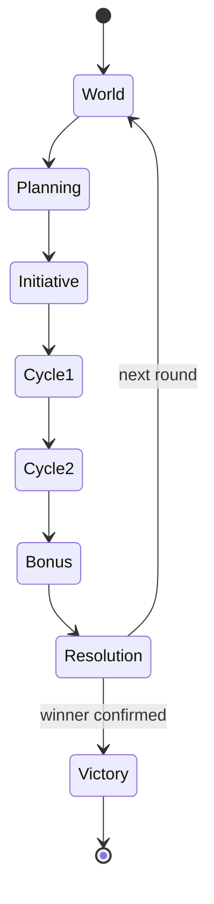
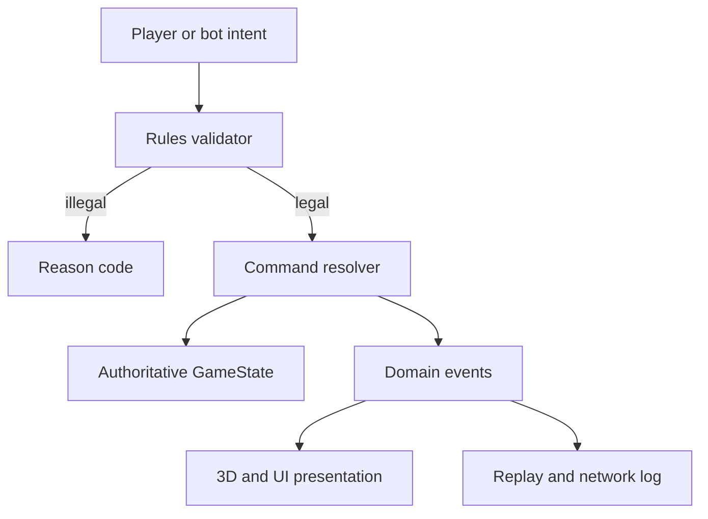
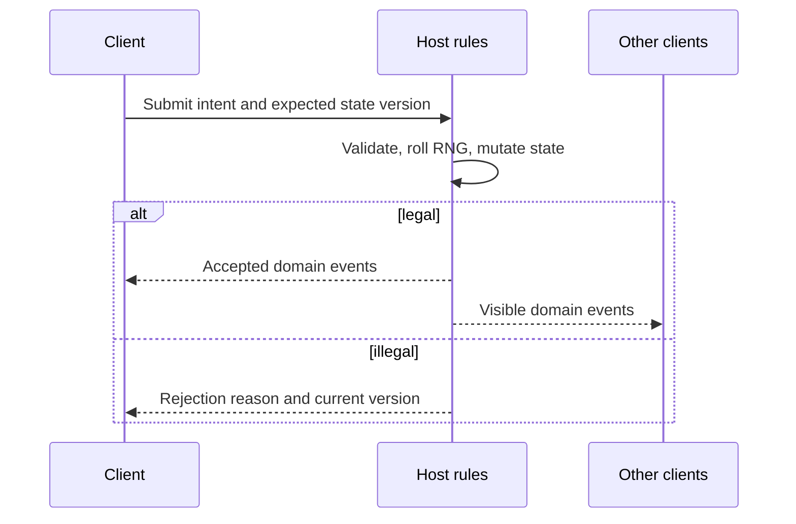

# Shattered Realm — Master Game Design and Codex Build Specification

> Working title: **Shattered Realm**. The title, setting names, and lore are provisional; the game structure is the source of truth.
>
> Target engine: **Godot 4.7.2 stable**, Standard edition, using statically typed GDScript. Do not build against Godot 4.8 development releases.
>
> Purpose of this document: this is both the consolidated design brief and the implementation prompt for a Codex coding agent. It distinguishes approved direction from prototype numbers that are expected to change during playtesting.

---

## 0. Instructions to the Codex agent

You are the engineering lead for a new Godot strategy game. Build a playable, testable vertical slice in the current workspace based on this document.

Before editing anything:

1. Inspect the repository and any `AGENTS.md`, `README`, project configuration, or existing code.
2. Preserve all unrelated user work and integrate with an existing Godot project if one is present.
3. If the workspace is empty, create a Godot 4.7.2 project from scratch.
4. Record any necessary implementation assumption in `docs/DECISIONS.md`. Do not silently reinterpret the game.
5. Treat the labels below as follows:
   - **LOCKED** — an agreed design direction. Do not change it merely for convenience.
   - **PROTOTYPE DEFAULT** — implement this value so the game is runnable, but keep it data-driven and easy to tune.
   - **DEFERRED** — architect for it where inexpensive, but do not build it before the vertical slice works.
   - **OPEN** — not yet decided. Use the stated fallback, document it, and continue unless the choice makes implementation impossible.

Engineering behavior:

- Work autonomously. Do not stop for minor design questions already answered by a prototype default.
- Build in vertical slices, keeping the project runnable after each milestone.
- Prioritize rules clarity, determinism, tests, and a complete game loop over visual polish.
- Use primitive or programmatically created meshes, simple materials, labels, and placeholder effects first. Do not wait for final art.
- Do not introduce third-party addons in the first milestones unless the repository already depends on them and they are healthy.
- Do not place authoritative rules inside UI nodes or animation callbacks.
- Do not let rendering, audio, or UI consume gameplay RNG.
- Run the relevant headless tests and launch checks after meaningful changes.
- If Godot is unavailable in the execution environment, still create the correct project and test structure, validate what can be validated statically, and report the runtime limitation precisely.
- Do not claim the whole game is complete after scaffolding. State exactly which milestone and acceptance criteria are complete.

The immediate work order is in section 29. Complete Milestones 0 and 1 first; if they pass, continue into Milestone 2. Do not begin online multiplayer or final art before the core rules are playable.

---

## 1. Product vision

### 1.1 High concept — LOCKED

Create a **4–8-player turn-based digital board game with RPG-style character identity and strategy-game positioning**. Players control one hero-led faction each on a compact, procedurally generated 3D hex map. They explore, fight monsters and rivals, capture and improve strategic locations, build an economy, collect relics, and pursue one of several visible victory routes.

The game should feel like a tabletop strategy game brought to life:

- short individual actions;
- a readable shared board;
- strong social interaction;
- tactical adaptation to a changing map and initiative order;
- meaningful randomness that players can influence;
- asymmetric characters that experience the same rules differently;
- enough depth for repeat play without Civilization-scale administration.

The game is **not** an army-management game. Each player primarily controls one hero/faction representative. Summons, followers, traps, structures, and temporary tokens may exist, but the player should not manage a large army of individual units.

### 1.2 Intended emotional arc — LOCKED

Each match should move through three natural stages:

1. **Early game — discovery and positioning**
   - Learn the generated terrain.
   - Find nearby towers, settlements, ruins, and monster camps.
   - Establish an initial direction without being permanently locked into it.
2. **Midgame — expansion and collision**
   - Upgrade a build.
   - Contest towers and roads.
   - Read opponents' developing victory plans.
   - Spend Fate to turn uncertain moments in a chosen direction.
3. **Late game — telegraphed threats and convergence**
   - Players collide around Ancient Towers and the central Worldspire.
   - Economic and Ascension attempts become visible.
   - Opponents receive a real opportunity to interfere.
   - A player wins because a plan survived pressure, not because a hidden counter reached a number without warning.

### 1.3 Design pillars — LOCKED

1. **Simple rules, complex interactions**  
   Each subsystem should be teachable in a few sentences. Depth should come from systems intersecting: terrain + timing + class powers + Fate + player intent.

2. **Randomness creates situations; decisions shape outcomes**  
   Random maps, events, rewards, initiative rolls, and combat dice create variation. Positioning, stance selection, resource allocation, and Fate let players improve their odds. Randomness must not regularly decide a match without meaningful counterplay.

3. **Initiative is temporal positioning**  
   Players care both about where they are and when they act. High Speed creates opportunity, not raw universal power. Acting late can also be useful because the player sees more of the cycle before committing.

4. **Multiple visible victory routes**  
   Conquest, economic Dominion, and Ascension must use the same shared map and create conflict with one another. They must not feel like three disconnected minigames.

5. **No player elimination**  
   Defeat hurts through health loss, displacement, dropped resources, lost control, or temporary disadvantage, but a player should not spend the rest of a long match spectating.

6. **Asymmetric interaction, not universal interruption**  
   There is no default “everyone gets one reaction” or universal Hearthstone Secrets system. Out-of-turn interaction comes from particular classes, structures, items, or abilities using explicit timing keywords.

7. **Readable at a glance**  
   Major landmarks, hero positions, tower owners, initiative, victory threats, and legal actions must be obvious. The interface may reveal depth progressively, but it must not resemble an aircraft cockpit.

8. **Data-driven and simulation-ready**  
   The complete rules layer must work without 3D graphics. This enables deterministic tests, bots, replays, saves, balance simulations, and host-authoritative multiplayer.

### 1.4 Complexity and scope constraints — LOCKED

- Full game: 4–8 players.
- First serious prototype: 4 players.
- Two normal actions per player per round.
- Two or three spendable core resources, not a dozen currencies.
- A compact map with roughly 50–100 hexes in the full vision and 12–20 meaningful locations.
- No per-tile food, production, population, culture, or ownership bookkeeping.
- No routine skipped turns, long stun locks, or mechanics whose main purpose is to prevent someone from playing.
- Normal actions should take approximately 5–20 seconds after players know the game.
- Larger decisions belong mainly in the simultaneous Planning phase.
- Full-match target is provisionally 45–75 minutes; the vertical slice should produce 20–35-minute matches. Both are tuning targets, not promises.

### 1.5 Explicit non-goals

- Not Civilization with fewer units.
- Not a real-time tactics game.
- Not a deck-builder where the board is secondary.
- Not an auto-battler, although controlled streak or comeback ideas may be explored later.
- Not a large-army RTS or 4X logistics simulator.
- Not a photorealistic or AAA graphics target.
- Not a game where every class receives the same reaction mechanic with a different visual skin.
- Not a game where the fastest class is automatically best at combat, movement, economy, and Fate generation.
- Do not import mechanics from older unrelated prototypes such as ATB bars, “roll three loot items,” Vampire-Survivors-style weapon fusion, or one-action attack-versus-roll turns unless the user explicitly reintroduces them.

---

## 2. Terminology

Use these terms consistently in code, UI, and documentation:

- **Round** — one full World → Planning → Initiative → two Action Cycles → Bonus → Resolution sequence.
- **Action Cycle** — one pass through the current initiative order in which every eligible player receives one action.
- **Action** — a discrete legal command such as Move, Attack, Capture, Explore, Upgrade, Trade, or a class Special.
- **Planning ability** — selected or prepared during Planning.
- **Reaction ability** — a specifically tagged ability that may trigger during another player's action. It is not a universal player entitlement.
- **Passive ability** — continuously or automatically applied.
- **Fate** — a capped tactical resource used to influence uncertain or time-sensitive outcomes.
- **Power** — a spendable magical/strategic resource, mainly produced by towers and spent on abilities or upgrades.
- **Gold** — a spendable economic resource, mainly produced by settlements and used for purchases, trades, and construction.
- **Relic** — a visible strategic object used by the Ascension route; not a normal spendable currency.
- **Location** — an interactable feature placed on a hex: tower, settlement, ruin, monster camp, Worldspire, and later shrines or portals.
- **Region** — a named cluster of hexes used for readability and possible later mechanics. Individual hexes are not normally owned.
- **Claim** — a telegraphed pending victory state that must survive a response window.
- **Worldspire** — the central landmark, Ancient Tower, and Ascension site in the prototype.
- **Hero** — the player's main board piece. “Player” is the person/account; “hero” is the game entity.
- **Sanctuary** — a player's starting/respawn location.

---

## 3. Match structure

### 3.1 Round sequence — LOCKED

Every round uses this state machine:

1. **World Phase**
2. **Planning Phase — simultaneous in rules**
3. **Initiative Phase**
4. **Action Cycle 1**
5. **Action Cycle 2**
6. **Bonus Action Cycle — only for rare granted actions**
7. **Resolution Phase**



### 3.2 World Phase

Responsibilities:

- Advance round number.
- Resolve one world event from round 2 onward.
- Update neutral monsters or environmental states when those systems exist.
- Open or close routes, create hazards, corrupt a region, awaken a location, or otherwise alter the strategic situation.
- Never make lengthy player decisions one at a time during this phase.

World events should usually **change a problem**, not simply award or remove a large amount of power. Good examples:

- A bridge collapses, but an alternate pass opens.
- A portal appears for two rounds.
- A monster migrates toward the richest settlement.
- A tower becomes unstable and yields more Power while becoming harder to hold.
- A region is cursed, changing its terrain modifier temporarily.

Round 1 has no world event so players can understand their starting situation.

### 3.3 Planning Phase — LOCKED

Rules-wise, all players plan simultaneously. The local prototype may gather choices sequentially behind a privacy overlay, but it must store submissions and reveal/resolve them as one phase.

Planning may include:

- buying or equipping upgrades;
- allocating Gold or Power;
- placing a Ranger trap;
- preparing a Cultist spell;
- queuing a legal structure or tower enhancement;
- spending Fate for an initiative modifier;
- selecting other explicitly tagged **Planning** abilities;
- marking the player ready.

Planning is not a universal reaction system. A prepared effect only interrupts later play if its definition has the **Reaction** keyword or an automatic trigger.

Prototype timing:

- No hard timer is required for local development.
- Add a visible Ready state.
- Architect online Planning for a configurable 45–60 second timer and automatic submission of “no change” on timeout.

### 3.4 Initiative Phase — LOCKED direction, PROTOTYPE formula

Calculate once per round:

`initiative_score = hero_speed + d3 + temporary_modifiers`

- Roll range is deliberately small so Speed remains meaningful.
- Sort highest score first.
- Resolve ties through the deterministic gameplay RNG and record the result.
- The same base order is used for both Action Cycles.
- Effects may move a hero earlier or later for Cycle 2 without rerolling the whole order.
- The current and upcoming order must always be visible in the HUD.

Examples:

- Ranger: Speed 5 + roll 1 = 6.
- Warlord: Speed 2 + roll 3 = 5.
- Forced March: +2 this round or next cycle.
- Entangling Roots: -2 next cycle; it does not erase an action.
- Heavy armor may impose -1 Speed as an equipment tradeoff.

Initiative design rules:

- Do not create routine “skip your next turn” effects.
- Movement, positioning, damage, and raw economic output should not all scale with Speed.
- Some slow characters should benefit from seeing earlier actions resolve.
- Initiative manipulation is a tactical tool and must be priced accordingly.

### 3.5 Action Cycles — LOCKED

In each cycle, visit each eligible player once in current initiative order. That player performs exactly one action. Then play passes immediately.

This is intentionally different from letting Player A perform two actions before Player B acts. It keeps waiting short and lets everyone adapt their second action to the first cycle.

Rules:

- Actions do not normally bank between rounds.
- Defending against an attack does not consume the defender's upcoming action.
- An attacker spends the Attack action even if the attack fails.
- UI animations must not delay the logical handoff longer than needed.
- If an effect changes Cycle 2 order, display the new order as soon as it is known.

### 3.6 Bonus Action Cycle — LOCKED rarity

Two base actions are nearly sacred. Extra actions are rare and usually restricted.

Preferred forms:

- “Move does not consume an action the first time you enter unexplored terrain this round.”
- “After defeating a hero, gain a bonus action that may only be used to Move.”
- “Destroy this relic to act once in the Bonus Cycle.”

Default handling:

- Complete both ordinary cycles first.
- Then eligible bonus-action holders act in initiative order.
- Immediate extra actions are exceptional, expensive, and should be tested for burst problems.

### 3.7 Resolution Phase

Resolve in a stable documented order:

1. Verify existing Conquest/Dominion claims and confirm any that survived the full response round. Stop if this produces a winner.
2. Pay location income.
3. Evaluate the post-income state and create any new Conquest/Dominion claims. A new claim cannot win during the Resolution in which it is created.
4. Apply regeneration/recovery.
5. Tick and expire statuses, traps, prepared effects, and cooldowns.
6. Reset once-per-round flags.
7. Grant normal round-based Fate, respecting the cap.
8. Persist an autosave/snapshot in development builds.
9. Transition to the next World Phase if there is no winner.

Ascension completes during an action and ends the match immediately; the Resolution check is only a defensive invariant. If any existing victory claim loses a requirement during the round, cancel it immediately rather than waiting for Resolution.

The exact order must be represented in tests because victory and income timing can change outcomes.

---

## 4. Action vocabulary

### 4.1 Core actions — LOCKED set

The long-term action vocabulary is:

- **Move**
- **Attack**
- **Capture**
- **Explore**
- **Upgrade**
- **Trade**
- **Recruit**
- **Special**

The vertical slice must implement Move, Attack, Capture, Explore, Upgrade, Trade, and at least one Special per prototype class. Recruit is deferred until followers/summons have a clear role; do not invent an army-management layer merely to implement the word.

### 4.2 General action rules

- The game model exposes the legal actions and legal targets; the UI never guesses legality.
- Selecting an action previews targets, path/cost, predicted modifiers, and important consequences.
- Confirming produces a command/intention that is validated again by the authoritative rules layer.
- Move and Attack are separate actions unless an ability explicitly combines or discounts them.
- A player can choose a legal **Wait/Pass** action, but the UI should warn when unused opportunities will be lost.
- Every rejected command returns a stable reason code suitable for UI text and tests.

### 4.3 Committed actions — LOCKED limited use

Some major strategic actions use two steps:

1. **Begin** the action and place a visible commitment token/state.
2. **Complete** it on the hero's next scheduled action if requirements still hold.

Use committed actions for events that deserve counterplay:

- claiming an Ancient Tower;
- completing an Ascension ritual;
- later, awakening or fighting a world boss.

Do not make ordinary movement, routine tower capture, or basic exploration two-step chores.

### 4.4 Prototype match setup — PROTOTYPE DEFAULT

- Four players/heroes occupy separate Sanctuaries.
- Every hero begins at full Health with 4 Gold, 2 Power, 1 Fate, no Relics, and no controlled locations.
- Reveal broad terrain, major landmarks, every hero, and all hex details within range 2 of each hero.
- Round 1 begins with a World Phase that draws no event, then proceeds normally.
- Initiative determines the first actor; there is no separate permanent first-player token.
- There is no hard round limit in an ordinary local match. Automated smoke simulations may stop at round 40 and report the match as stalled rather than inventing a winner.

---

## 5. Map and spatial design

### 5.1 Map form — LOCKED

- Procedurally generated **hex grid**.
- High-angle, rotatable 3D view similar in readability to a civilization strategy game, but much smaller and mechanically lighter.
- Logical hex graph is independent from 3D meshes and animation.
- Pointy-top axial coordinates `(q, r)` are the prototype standard.
- Hero positions, terrain, locations, roads, and ownership are stored in model coordinates, never inferred from transforms.

### 5.2 Prototype map — PROTOTYPE DEFAULT

Use a radius-4 hexagon: **61 logical hexes** before any optional removal or decorative edge treatment.

Place exactly 16 meaningful locations for the initial four-player rules test:

- 4 Ancient Towers, one of which is the central Worldspire;
- 4 Minor Towers;
- 2 Settlements;
- 2 Ruins;
- 4 Monster Camps.

Create four Sanctuary/spawn hexes near different edges. A Sanctuary is a special spawn marker and does not count against the 16 locations.

Long-term maps may range from roughly 50–100 hexes and scale location count and distances with player count.

### 5.3 Terrain — LOCKED categories, PROTOTYPE values

| Terrain | Movement rule | Combat/visibility rule |
|---|---:|---|
| Plains | Cost 1 | No modifier |
| Forest | Cost 2 | Defender gains +1 Defence; Ranger treats movement cost as 1 |
| Swamp | Entering costs all remaining movement points, minimum 1 | No default Defence bonus |
| Mountain | Impassable | Blocks ground movement; may block line of sight later |
| Water | Impassable without bridge/ability | Decorative/route-forming in first slice |
| Road | Normal edge cost 1 | A Move action entirely following a connected road receives 4 MP instead of 3 |
| Bridge | Crossing its marked edge costs 1 | May be opened/closed by events later |

Keep terrain rules few enough to remember. New terrain must earn its complexity by producing a distinct decision.

### 5.4 Movement — LOCKED direction, PROTOTYPE values

- Base movement budget: 3 movement points per Move action.
- Compute reachable hexes through Dijkstra or another weighted graph search over the logical map.
- Display total cost and the chosen lowest-cost path before confirmation.
- Enemy-occupied hexes cannot be entered.
- Heroes cannot share a hex in the free-for-all mode.
- Attacks normally target an adjacent hex.
- A path cannot pass through an enemy hero.
- Whether a path may pass through another non-hostile hero is OPEN; prototype fallback: it may not.
- If a swamp is entered, movement ends even if a later effect would refund points.
- Movement bonuses should more often bend terrain rules than grant enormous universal range.

### 5.5 Hex coordinate implementation

Use a dedicated tested utility for:

- six axial directions;
- neighbors;
- axial/cube conversion;
- hex distance;
- rings and ranges;
- axial-to-world and world-to-axial projection;
- map bounds;
- deterministic sorting of coordinates.

The renderer may add height and decoration, but the hero's authoritative position remains an axial coordinate.

### 5.6 Visibility and discovery — LOCKED partial information

Avoid both extremes of a completely revealed optimization puzzle and blind exploration.

Prototype visibility:

- All broad terrain is visible from match start.
- The Worldspire, Ancient Towers, Sanctuaries, and approximate rival starting areas are visible.
- All hero positions are visible; PvP should be strategic, not accidental.
- Minor location type/details and tower traits can remain concealed until a hero comes within two hexes.
- A discovered location remains known.
- Ranger receives superior discovery information through class abilities.
- Hidden traps are private state, but opponents see any generic warning marker required by balance. Prototype fallback: opponents know a trapped hex exists but not the trap type.

### 5.7 Regions — LOCKED concept, light prototype use

Group contiguous hexes into 4–6 named regions such as Blackwood, Ash Plains, or The Mire. Regions primarily provide a social and visual vocabulary:

- “The Necromancer controls Blackwood” is better than “the Necromancer is at hex 2,-3.”
- Show region names on hover and at suitable zoom.
- Do not assign every hex a player owner.
- Region control may later mean controlling its key tower, but it has no required mechanical effect in Milestone 1.

### 5.8 Chokepoints and alternate routes — LOCKED

Mountains, water, and roads should create meaningful passes, but the generator must not allow a single early tower to lock a player out of most of the game.

For major regions and the Worldspire, aim for:

- one short, contested route;
- one longer alternative route;
- later, a conditional portal or engineered route.

At minimum, every spawn must have a valid route to the Worldspire and to at least two neighboring regions.

---

## 6. Procedural generation

### 6.1 Core principle — LOCKED

Generation is **structured randomness**, not independent random placement. Maps should be asymmetric in appearance and equivalent in opportunity.

### 6.2 Deterministic generation pipeline

For a given map seed:

1. Create the axial coordinate set.
2. Generate clustered terrain fields.
3. Place impassable mountain/water features.
4. Repair walkable connectivity.
5. Select four balanced Sanctuary zones.
6. Reserve the central Worldspire area.
7. Place the remaining Ancient Towers.
8. Place Minor Towers and Settlements.
9. Create roads connecting selected locations.
10. Place Ruins and Monster Camps.
11. Assign tower traits and hidden location content.
12. Partition/name regions.
13. Score spawn opportunities and travel distances.
14. Repair or regenerate invalid portions.
15. Emit a generation report in debug builds.

Use a capped number of repair/regeneration attempts and fail with a useful diagnostic rather than hanging.

### 6.3 Fairness validation — PROTOTYPE DEFAULT

Each spawn should satisfy:

- Worldspire is reachable.
- At least one capturable Minor Tower or Settlement is reachable within a movement cost of 6.
- At least one exploration/combat opportunity is reachable within a movement cost of 8.
- No other spawn begins within immediate attack range.
- Shortest-path distance to the Worldspire differs by no more than 3 movement cost among players.
- Early opportunity score differs by no more than 25% among players.

Suggested early opportunity weights for validation only:

- Minor Tower: 3
- Settlement: 3
- Ruin: 2
- Monster Camp: 2
- Useful road access: 1

These weights are generation heuristics, not visible victory points.

### 6.4 Map presets — DEFERRED after core generator

Architect parameters for:

- size: Small / Medium / Large;
- terrain: Balanced / Mountainous / Islands / Wildlands;
- world danger: Low / Normal / Brutal;
- tower density: Low / Normal / High.

Do not build elaborate preset UI until the balanced four-player generator passes validation reliably.

---

## 7. Locations, ownership, and economy

### 7.1 Ownership model — LOCKED

Players own **locations**, not ordinary hexes. A controlled location shows its owner through color plus a non-color indicator such as banner shape or emblem.

A tower may project influence for vision, defence, roads, or abilities, but do not paint every nearby tile as owned territory in the core game.

### 7.2 Minor Towers

Prototype behavior:

- Neutral, unguarded Minor Tower: Capture costs one action while standing on the hex.
- Enemy tower with owner hero present: the hero must first be displaced/downed through combat.
- Enemy tower without its hero present: one Capture action resolves against the tower's Defence value.
- Base Tower Defence: 4, plus upgrade and type modifiers.
- Successful unopposed capture transfers control immediately.
- Controlled Minor Tower produces +1 Power during Resolution.
- Controller receives +1 Defence while defending on it.

### 7.3 Ancient Towers

- More strategically important than Minor Towers.
- Capturing an uncontrolled or enemy Ancient Tower is a committed action: **Begin Capture**, then **Complete Capture** on the hero's next scheduled action.
- The pending capture commitment is public and is distinct from a victory claim.
- Leaving the hex, being displaced/downed, or an enemy successfully contesting the location cancels it.
- Produces +2 Power during Resolution.
- Counts toward Conquest.
- The central Worldspire is an Ancient Tower with special victory functions.

### 7.4 Tower variants — LOCKED concept, data-driven

Long-term variants:

- **Watchtower** — expanded vision.
- **Mana Tower** — additional Power.
- **Fortress** — stronger defensive bonus.
- **Waystone Tower** — enables later fast travel between linked towers.
- **Ruined Tower** — initially weak, cheaper or more flexible to rebuild.

For the first slice, implement at least two variants, preferably Watchtower and Fortress, as data rather than subclass conditionals.

### 7.5 Settlements

Prototype behavior:

- Captured with one action if unoccupied and neutral.
- Produce +2 Gold during Resolution.
- Permit the Trade action.
- Permit buying generic upgrades during Planning when the hero begins Planning on that settlement or controls it. Choose one rule and document it; fallback: control is sufficient.
- Merchant receives class-specific economic benefits.

### 7.6 Roads and trade networks

Roads connect selected locations and accelerate movement. They also create the visible network required for the Dominion route.

Prototype definition of a connected economic network:

- Two controlled Settlements are connected if a road path exists between them through walkable hexes and no intermediate key location on that path is controlled by an opponent.
- If only two Settlements exist, owning both creates the core network.
- Merchant abilities may loosen or enhance this rule later.

### 7.7 Ruins

- Require an Explore action.
- A ruin has a deterministic seeded reward/event table.
- Rewards may include Gold, Power, an upgrade, information, a temporary effect, or a Relic.
- Negative outcomes should usually offer a decision, risk, or compensation rather than unavoidable punishment.
- Fate may be used to manipulate an exploration result as defined in section 10.
- Most ruins become exhausted after one successful exploration; visually change their state.

### 7.8 Monster Camps

- Contain a visible or discoverable monster definition.
- Entering the adjacent attack range does not automatically consume an action.
- Attack uses the same core combat resolver where practical.
- Monsters have no stance in the first slice; they use a fixed behavior profile and a deterministic seeded die roll.
- Rewards may include Gold, Power, upgrades, or a Relic.
- Cleared camps remain visibly cleared; later world events may repopulate them.

### 7.9 Upgrading locations

Use a visible maximum of three levels.

- Level 1: captured base location.
- Level 2: costs 3 Gold and one Upgrade action; +1 Defence or improved trait.
- Level 3: costs 5 Gold and one Upgrade action; another trait improvement or +1 income, never both by default.

Exact values are prototype defaults. Avoid runaway compounding: upgrades should make a location meaningfully better without making it impossible to contest.

---

## 8. Resources and progression

### 8.1 Resource set — LOCKED structure

The spendable core resources are:

1. **Gold** — economy, purchases, construction, trade, bribes.
2. **Power** — class abilities, magical/strategic upgrades, special map interactions.
3. **Fate** — capped tactical influence over randomness and timing.

Health is a combat state, not a currency. Relics are objectives, not a general spendable resource. A Dominion claim is a victory state, not another wallet.

### 8.2 Gold

- Visible to all players in the prototype.
- Generated mainly by Settlements and economic abilities.
- Spent on upgrades, market trades, structures, and Merchant effects.
- Do not create an instant “reach 100 Gold and win” threshold with no response window.

### 8.3 Power

- Visible to all players in the prototype.
- Generated mainly by Towers, exploration, and monsters.
- Spent on class abilities, prepared effects, traps, and selected upgrades.
- Prototype cap: 12. This is tunable and prevents unbounded hoarding.

### 8.4 Lightweight RPG progression — LOCKED direction

Characters should develop during a match, but inventory management must remain compact.

Rules direction:

- Class identity comes from base stats, a passive, one or more class abilities, and a small upgrade path.
- A hero equips at most three ordinary upgrades in the prototype.
- Upgrades should create choices rather than automatic linear scaling.
- Prefer effects that change play patterns over repeated +10% modifiers.
- Definitions live in custom Resources/data files.
- Initial full-content target was approximately 20 upgrades; the vertical slice needs only 8–12 well-distinguished placeholders.

Suggested generic prototype upgrades:

- Iron Weapon: +1 Attack.
- Reinforced Armor: +1 Defence, -1 initiative modifier.
- Trail Boots: ignore the first extra Forest movement cost each Move action.
- Scout Lens: reveal location details one hex farther.
- Tower Kit: reduce the next location upgrade cost by 1 Gold.
- Lucky Charm: once per round, a Fate reroll may keep the better of the two rolls; price this highly.
- Merchant Seal: market trades improve by one unit.
- Ward Stone: +1 Defence while carrying a Relic.

Generic upgrades cost 4 Gold by default; unusually strong definitions such as Lucky Charm should cost 6. All values and availability are provisional. Implement definitions so designers can edit `.tres` or equivalent data without changing resolver code.

---

## 9. Fate system

### 9.1 Purpose — LOCKED

Fate is the primary bridge between randomness and agency. It should make players ask, “Is this roll important enough to influence?” without letting them remove uncertainty from every event.

### 9.2 Core rules — LOCKED direction, PROTOTYPE values

- Maximum Fate: **5**.
- At Resolution, every player gains +1 Fate, up to the cap.
- A player who loses a hero combat by a margin of 4 or more gains +1 Fate, at most once per round.
- Each class has one thematic Fate trigger, at most once per round unless stated otherwise.
- Fate amount is public; hidden planned use remains private until revealed.
- Spending can never reduce Fate below zero.

### 9.3 Universal Fate spends

Implement in this order:

1. **Reroll — 1 Fate — vertical slice**  
   After both combat dice are revealed, reroll your own die once. The new roll is final unless an explicit upgrade says otherwise.

2. **Initiative Push — 2 Fate — vertical slice**  
   During Planning, gain +2 initiative score for the coming round. It changes opportunity, not stats.

3. **Explore the Alternatives — 2 Fate — Milestone 3**  
   When resolving a ruin reward, reveal two eligible outcomes and choose one, or reroll the outcome according to the implemented reward architecture.

4. **Twist Fate — 3 Fate — deferred/tuning-sensitive**  
   Force an opponent to reroll one die or prevent a severe injury. Do not implement until reaction timing is clear and tests show it is necessary.

### 9.4 Class Fate triggers — LOCKED examples, PROTOTYPE limits

- **Ranger:** first time each round the Ranger discovers a new location, gain 1 Fate.
- **Merchant:** first completed Trade each round, gain 1 Fate.
- **Cultist:** first time each round the Cultist knowingly accepts the negative branch of an event, gain 1 Fate.
- **Necromancer:** first unit/monster death within two hexes each round creates a Soul or grants 1 Fate, depending on final class resource design.
- **Engineer:** first new structure or location upgrade completed in a new region each round, gain 1 Fate.
- **Warlord:** first time each round the Warlord attacks a strategically stronger opponent, gain 1 Fate. Prototype definition of stronger: opponent controls more Towers or has a higher total equipped-upgrade tier.

Avoid Fate-on-easy-win loops. The system should compensate risk, archetypal play, and bad luck more often than it rewards an already dominant player.

### 9.5 Fate UX

- Display 0–5 clear pips on every player card.
- When a legal Fate window opens, show cost, effect, and current amount.
- Make “Decline” the easy default.
- Log every spend and gain with cause.
- A reroll animation is presentation only; the result comes from the authoritative RNG event.

---

## 10. Heroes and class identity

### 10.1 Shared hero model

Each hero has at least:

- stable entity ID;
- owning player ID;
- class definition ID;
- current/max Health;
- Attack;
- Defence;
- Speed;
- base movement budget;
- current axial coordinate;
- Gold, Power, and Fate;
- carried Relics;
- equipped upgrades;
- statuses;
- prepared effects/traps;
- once-per-round flags;
- controlled location IDs;
- visible victory claim state.

Stats remain small integer values so players can reason about outcomes.

### 10.2 Prototype roster — PROTOTYPE DEFAULT

Implement these four first because together they exercise exploration, combat, economy, prepared effects, and all three victory paths.

| Class | HP | Attack | Defence | Speed | Move | Primary identity |
|---|---:|---:|---:|---:|---:|---|
| Ranger | 8 | 3 | 2 | 5 | 3 | Terrain mastery, discovery, traps |
| Warlord | 12 | 5 | 4 | 2 | 3 | Direct combat, challenge, pressure |
| Merchant | 9 | 2 | 3 | 3 | 3 | Gold, roads, trades, deals |
| Cultist | 9 | 3 | 2 | 3 | 3 | Relics, prepared magic, risky choices |

These values are intentionally not assumed balanced. Put them in data definitions and include a debug table/export.

### 10.3 Ranger

- **Passive — Pathfinder:** Forest costs 1 movement point instead of 2.
- **Planning — Snare:** spend 1 Power to place one trap on an eligible discovered hex within two hexes. Maximum one active Snare in the first slice.
- **Reaction/automatic — Snare trigger:** first enemy entering the hex ends movement and receives -2 initiative score for the next cycle. Re-sort the remaining/current next-cycle order deterministically after the modifier; never remove the hero's action.
- **Explore affinity:** when exploring a Ruin, reveal slightly more information or use a favorable reward rule.
- **Fate trigger:** discover a new location.

The Ranger is likely to act early, but does not receive universal raw damage or economy superiority.

### 10.4 Warlord

- **Passive — Martial Presence:** +1 Attack while contesting an enemy-controlled Tower, not while farming neutral monsters.
- **Reaction — Challenge:** once per round, when an enemy's movement would pass from adjacent to non-adjacent, the Warlord may end that movement adjacent to the Warlord. The trigger and legal choice must be clear; it must not erase the enemy's entire action before any movement occurs.
- **Action/Special — Forced March:** spend 1 Power during Move to ignore one difficult-terrain penalty and gain +2 initiative for the next cycle.
- **Fate trigger:** challenge a stronger opponent as defined above.

The Warlord is slow but dangerous. High Attack/Defence is the compensation for lower initiative.

### 10.5 Merchant

- **Passive — Networker:** each controlled Settlement produces +1 additional Gold if it is part of the Merchant's connected road network.
- **Action — Trade:** at a controlled or neutral Settlement, exchange resources using the current market rule. Prototype market: pay 2 Gold for 1 Power, or 1 Power for 2 Gold, once per Trade action.
- **Reaction — Bribe:** once per round when another hero declares an attack against the Merchant, the Merchant may offer 2 Gold. The attacker may accept, receiving the Gold and canceling the attack, or refuse, giving the Merchant +1 Defence for that combat. Accepting the bribe still consumes the declared Attack action. Bots require an explicit deterministic evaluation rule.
- **Fate trigger:** complete a Trade.

Later, the Merchant may broker mercenary contracts between other players. Do not build free-form negotiation UI in the first slice.

### 10.6 Cultist

- **Passive — Occult Sense:** receive an imprecise hint when an undiscovered Relic is within three hexes; reveal direction or region, not the exact tile.
- **Planning — Prepared Hex:** spend 1 Power and select a visible enemy. The first time that enemy initiates combat before the next Planning phase, apply -1 to its combat die. This is an explicit Reaction effect.
- **Action/Special — Dark Bargain:** at an eligible Ruin, accept a guaranteed negative consequence to improve Relic odds or gain Power. The choice and odds must be shown.
- **Fate trigger:** accept a negative event branch.

The Cultist is naturally suited to Ascension but must not be the only class capable of winning that way.

### 10.7 Expansion classes — DEFERRED content, LOCKED interaction styles

**Engineer**

- Strong Defence, low Speed.
- Builds roads, bridges, barriers, and automated tower effects.
- Interacts outside its turn primarily through structures such as Watchtowers and barriers, not personal reaction prompts.
- First location upgrade in a new region can generate Fate.

**Necromancer**

- Gains value from deaths and cleared monster camps.
- Uses corpse or Soul tokens as lightweight effects; do not turn the core game into army micromanagement.
- Automatic death triggers make other players' combat interesting to the Necromancer.
- A later summon should be a simple temporary token or modifier unless a strong design case exists for an independently acting unit.

### 10.8 Ability timing keywords — LOCKED

Every ability definition has one timing category:

- **Action** — used as the player's current action.
- **Planning** — submitted during Planning.
- **Reaction** — may trigger during another action when a declared condition occurs.
- **Passive** — continuously/automatically evaluated.

The UI must show the keyword. Reaction prompts are only created by an owned legal Reaction; never ask every player to decline after every action.

---

## 11. Combat

### 11.1 Combat goals — LOCKED

Combat should be quick, social, and uncertain without being arbitrary. Character stats, board position, stance choice, and Fate all matter. The defender does not lose an action merely because someone attacked.

### 11.2 Starting combat

- Attack normally targets an adjacent enemy hero or monster.
- Declaring Attack consumes the attacker's current action once validated.
- Open a short stance-selection window for the participating heroes.
- Stances are chosen secretly and revealed together.
- Monsters use a fixed behavior profile and do not create a stance prompt in the first slice.
- Relevant Reactions resolve at documented timing points.

### 11.3 Core opposed roll — LOCKED direction

For hero versus hero:

`attacker_total = attacker.Attack + attacker_stance_modifier + terrain/location/status modifiers + d6`

`defender_total = defender.Defence + defender_stance_modifier + terrain/location/status modifiers + d6`

`margin = attacker_total - defender_total`

- Ties favor the defender.
- Show the entire calculation after reveal.
- Values are small integers.
- All dice come from the deterministic combat RNG stream and are recorded as domain events.

### 11.4 Stances — LOCKED concept, PROTOTYPE matrix

Both heroes select one of four stances:

| Stance | Prototype effect |
|---|---|
| **Assault** | +2 combat total. If this hero loses, suffer +1 damage. Reliable aggression with risk. |
| **Guard** | +1 combat total. If this hero loses, reduce resulting damage by 1, minimum 1. |
| **Counter** | +3 combat total if the opponent chose Assault; otherwise -1 combat total. If defending and victorious against Assault, deal 1 retaliation damage. |
| **Trick** | Costs 1 Fate. Gain +2 combat total against Guard or Counter; gain 0 against Assault or Trick. Suppress Guard's damage reduction or Counter's retaliation if Trick wins. |

This matrix is a prototype implementation of the approved stance-and-Trick idea, not a final balance claim. Keep it data-driven and test every pairing. If playtesting shows a dominant stance, change data before rewriting the combat architecture.

### 11.5 Fate reroll window

After both dice and stances are revealed:

1. Attacker may spend 1 Fate to reroll its own die.
2. Defender may then spend 1 Fate to reroll its own die with knowledge of the attacker's final value.
3. Each participant may reroll at most once per combat.
4. The rerolled value replaces the original.

The order gives the defender a small informational advantage, consistent with ties favoring the defender. If online play later uses simultaneous sealed Fate decisions, that is a future rules change, not a networking shortcut.

### 11.6 Outcome by margin — PROTOTYPE DEFAULT

After all modifiers and Fate rerolls:

| Margin | Result |
|---:|---|
| `<= 0` | Attack fails; defender holds. If margin is `<= -4`, attacker suffers 1 damage from overextension. |
| `1–3` | Defender suffers 2 damage. |
| `4–6` | Defender suffers 3 damage and is displaced to one legal adjacent hex chosen by the defender. |
| `7+` | Defender suffers 4 damage, is displaced, and drops 1 Gold on the contested hex if carrying any. |

Additional rules:

- If no legal displacement hex exists, suffer +1 damage instead.
- A displaced defender loses a pending committed action.
- Winning combat does not automatically capture a location; Capture remains a separate action unless an ability explicitly says otherwise.
- A hero may advance into a vacated target hex only if a class/upgrade explicitly grants it in the first slice. Default: remain in place.
- Do not add critical hits in the first slice; stance and Fate already provide sufficient variance.

### 11.7 Defeat, recovery, and no elimination — LOCKED

When Health reaches 0 or lower:

1. Mark the hero downed for the combat result.
2. Drop one carried Relic on the defeat hex; if there is no Relic, lose up to 2 Gold instead.
3. Cancel pending captures, rituals, and prepared location commitments.
4. Relocate the hero immediately to its Sanctuary.
5. Restore it to 60% maximum Health, rounded up.
6. Apply **Recovering** until the next World Phase: the hero cannot be targeted and has -1 Attack/Defence, but it does not automatically lose a scheduled action.
7. Grant 1 Fate if the normal cap and once-per-round compensation rule allow it.

This prevents elimination and discourages repeated spawn attacks. If a downed hero still has an action later in the same cycle, it may act from the Sanctuary while Recovering.

### 11.8 Healing

- Resolution restores 1 Health to heroes not downed that round.
- **Rest** is a Special action at a Sanctuary or controlled Settlement: restore 3 Health.
- Healing cannot exceed maximum Health.
- More healing content is deferred until combat pacing is measured.

---

## 12. Reactions and out-of-turn interaction

### 12.1 Rule — LOCKED

There is no universal reaction allowance. **Reaction** is an ability keyword. Classes relate to other turns asymmetrically:

- Ranger — hidden or partially hidden traps.
- Cultist/Wizard archetype — prepared spells.
- Engineer — automated structures.
- Warlord — direct challenge and retaliation.
- Merchant — deals, bribes, and market interference.
- Necromancer — automatic death triggers.

Some classes may have no manual reaction prompt and that is acceptable. Different cognitive loads support different player preferences.

### 12.2 Reaction timing engine

Model reactions as explicit windows emitted by authoritative commands, for example:

- `BEFORE_MOVEMENT_STEP`
- `AFTER_ENTER_HEX`
- `ON_ATTACK_DECLARED`
- `AFTER_STANCE_REVEAL`
- `AFTER_DICE_ROLLED`
- `ON_UNIT_DEFEATED`
- `BEFORE_LOCATION_CAPTURED`

Each eligible effect declares:

- timing window;
- trigger condition;
- owning player/entity;
- whether it is optional or automatic;
- cost;
- legal targets;
- priority/order;
- expiration.

For the vertical slice, support only the windows required by Snare, Challenge, Bribe, and Prepared Hex. Do not build a fully general card-game stack unless the concrete rules require it.

### 12.3 Prompt discipline

- Automatic effects resolve without pausing after a brief visual cue.
- Optional reactions prompt only the owner and only when legal.
- Repeated optional prompts need “always decline for this round” where appropriate.
- Online timeouts default to decline.
- A reaction must never quietly mutate state from a presentation script.

---

## 13. Exploration, events, monsters, and relics

### 13.1 Controlled randomness rules — LOCKED

- Display relevant odds or at least qualitative risk before irreversible choices.
- Use small bounded rolls and weighted tables.
- Avoid events that randomly remove a full turn.
- Avoid large hidden rubber-banding.
- Let Fate or class abilities alter important outcomes at an explicit cost.
- Seed and log every result.

### 13.2 Event content target

The original prototype target is approximately 15 world/local events. The first playable slice needs 5:

1. **Collapsed Bridge** — one bridge closes for two rounds; reveal alternate route.
2. **Unstable Leyline** — one Tower produces +1 Power and has -1 Defence for a round.
3. **Monster Migration** — move or strengthen one camp toward the richest region.
4. **Cursed Ground** — one region's Plains behave as Forest for movement for one round.
5. **Wandering Market** — one neutral hex acts as a Settlement for Trade until Resolution.

Events must be data definitions with conditions and resolver IDs, not UI-specific scripts.

### 13.3 Monster content target

The original prototype target is roughly 10 monsters. The vertical slice needs 3 reusable profiles:

- **Wolf Pack** — low Defence, moderate Attack, Gold reward.
- **Stone Guardian** — high Defence, guards Towers/Ruins, Power reward.
- **Relic Wraith** — dangerous, Relic reward, possibly Fate interaction.

Use the shared combat result model but fixed monster behavior. A monster defeat is permanent for that camp in the first slice.

### 13.4 Relics

- Exactly three Relics are required for an Ascension attempt.
- Generate at least four possible Relic sources so the route is contested but not dependent on one tile.
- A Relic carrier is publicly marked; exact relic identity may be public as well in the prototype.
- Relics can come from Ruins, stronger Monster Camps, or rare events.
- A downed carrier drops one Relic on the defeat hex.
- Picking up an unclaimed Relic on the current hex costs an Explore/Interact action unless an effect says otherwise.
- Relics may have small passive powers later, but their objective role comes first.

---

## 14. Victory conditions

### 14.1 Shared principles — LOCKED

- Three primary routes: Conquest, Dominion, Ascension.
- All routes are visible and interruptible.
- No hidden instant threshold win.
- Victory checks occur at defined timing points.
- UI shows every player's progress and any active claim.
- A player can pivot routes; classes encourage but do not hard-lock a route.

### 14.2 Conquest — LOCKED structure, PROTOTYPE count

Requirement:

- Control all four Ancient Towers, including the Worldspire.
- At Resolution, if the requirement is met and no Conquest claim exists, declare a public Conquest claim.
- Win at the next Resolution if the player still controls all required Towers.

This guarantees one full round of response. If the player loses any required Tower, cancel the claim visibly.

For larger maps, the exact required number may be four Ancient Towers including the central landmark rather than literally all Ancient Towers. Keep the requirement data-driven.

### 14.3 Dominion/economic victory — LOCKED structure, PROTOTYPE threshold

Requirement:

- Control both prototype Settlements.
- Maintain a valid connected road network between them.
- Hold at least 15 Gold at Resolution.
- Declare a public Dominion claim.
- Win at the next Resolution if all conditions still hold.

Spending below 15 Gold, losing a Settlement, or breaking the network cancels the claim. This route should generate map conflict over roads and settlements, not reward a player for sitting unseen in a corner.

The final game may use an Influence/Dominion track rather than pure held Gold if hoarding proves unfun. Do not add a fourth spendable currency during the first slice.

### 14.4 Ascension — LOCKED structure

Requirement:

- Carry three Relics.
- Stand on the Worldspire.
- Use an action to **Begin Ritual**.
- Remain on the Worldspire with all three Relics until the hero's next scheduled action.
- Use that next action to **Complete Ritual** and win immediately.

The ritual is public. Leaving, being displaced/downed, losing a Relic, or having the ritual explicitly disrupted cancels it. Because action cycles interleave players, opponents naturally receive a response window.

### 14.5 Simultaneous victory and tie handling — PROTOTYPE DEFAULT

- Completed Ascension is immediate and takes precedence because it consumes an action and resolves before Resolution.
- At Resolution, evaluate existing claims before creating new claims.
- If multiple existing claims survive the same Resolution, compare how many full rounds each has been held; normally equal.
- Prototype fallback for a true simultaneous claim: shared victory. Do not decide it with an unrelated die roll.
- Record tie behavior as an OPEN balance decision for later competitive modes.

### 14.6 Deferred streak mechanic

Win/loss streak rewards inspired by TFT were considered attractive, including the possibility of strategically using a losing streak. They are explicitly **deferred from the first iteration** to preserve simplicity. Do not implement them until baseline economy and combat data exist.

---

## 15. Turn length, player count, and modes

### 15.1 Supported modes roadmap

1. **Development sandbox** — one developer controls all seats; debug shortcuts allowed.
2. **Local match** — 1 human plus simple bots, configurable up to 4 in the first slice.
3. **Local hotseat** — optional but useful for hidden planning/stance UX tests.
4. **Online friend match** — 4–8 players, host authoritative; deferred until core rules stabilize.
5. **Bot simulations** — headless, no renderer, for balance and regression.

### 15.2 Time budgets

Design targets after onboarding:

- Ordinary Move/Capture/Explore: 5–10 seconds.
- Ordinary combat including choices: 15–30 seconds.
- Planning: 45–60 seconds online.
- Action timeout: provisionally 20 seconds online, with a safe Pass/AI fallback.

The local vertical slice does not require timers, but the state machine must not depend on indefinite UI callbacks.

---

## 16. User experience and interface

### 16.1 Information hierarchy — LOCKED

At all times the player should quickly answer:

- What phase and round is this?
- Whose action is now and who acts next?
- How many actions remain this round?
- Where is my hero?
- What can I legally do?
- What will this path/action cost?
- Who owns important locations?
- How much Health, Gold, Power, and Fate does each player have?
- Is anyone threatening a victory?
- What just happened?

### 16.2 Main HUD — PROTOTYPE layout

- **Top center:** round, phase, cycle, and contextual instruction.
- **Top strip:** initiative portraits in order; current actor enlarged; Cycle 2 changes previewed.
- **Left side:** compact player cards with Health, Gold, Power, Fate pips, Relics, class icon, and claim warning.
- **Bottom center:** context-sensitive action bar.
- **Right side:** collapsible event/combat log and selected hex/location panel.
- **On map:** reachable hexes green, attackable targets red, interactable locations gold, committed actions pulsing, paths previewed.

Never rely on color alone; use icons, borders, patterns, or banner shapes.

### 16.3 Input — PROTOTYPE DEFAULT

- Left click: select hero, hex, target, or UI action.
- Right click: cancel/back; optional contextual Move after selection if unambiguous.
- WASD or edge pan: move camera rig.
- Mouse wheel: zoom.
- Middle-mouse drag or Q/E: rotate camera.
- F or Home: focus current hero.
- Escape: pause/settings or close current modal.
- Enter/Space: confirm only when focus and accessibility behavior are safe.

All core actions must remain available through visible UI, not secret shortcuts.

### 16.4 Action flow example

Move:

1. Select hero.
2. Select Move.
3. Rules layer returns reachable coordinates and costs.
4. Hover previews path, movement cost, terrain effects, and trap warning if known.
5. Click destination.
6. Confirmation is required only for unusual risk or leaving a commitment.
7. Submit command; model resolves; presentation animates emitted events.

Combat:

1. Select Attack and legal target.
2. Display known Attack/Defence and board modifiers.
3. Submit attack declaration.
4. Handle eligible reactions.
5. Gather hidden stances.
6. Reveal stances and dice.
7. Offer legal Fate rerolls.
8. Display calculation and outcome.
9. Animate damage/displacement and return to action flow.

### 16.5 Planning UI

- Show available Gold, Power, and Fate.
- Present only legal preparations/purchases.
- Summarize submitted plan before Ready.
- In hotseat mode, use a privacy handoff screen between players.
- In online mode, show only readiness, not private choices.

### 16.6 Tooltips and teaching

- Every stat and timing keyword has a concise tooltip.
- First-time contextual tips explain Fate, committed actions, and victory claims.
- Provide a persistent Rules/Glossary panel.
- Do not front-load a long tutorial before the board appears.
- Debug builds may show exact formulas, IDs, seed, coordinate, and path cost.

### 16.7 Accessibility baseline

- Scalable UI.
- Remappable keyboard controls where practical.
- Color-blind-safe ownership markers.
- Option to reduce camera motion, screen shake, and flashing.
- Adjustable animation speed; “fast actions” option.
- Text log of all mechanically relevant events.
- Subtitles/captions for any future voiced or audio-only cue.

---

## 17. Visual and audio direction

### 17.1 Art direction — LOCKED

Use stylized 3D rather than realism:

- high-angle strategy camera;
- readable low- to mid-poly terrain;
- slightly exaggerated tabletop-miniature proportions;
- strong class silhouettes;
- clear team accents and banners;
- attractive lighting, fog, particles, and animation used selectively;
- no requirement for detailed faces, realistic hair, or AAA materials.

The intended impression is a living fantasy board with physical pieces, not a flat spreadsheet and not a photorealistic battlefield. Reference broad qualities such as readable miniatures, chunky geometry, and strong atmosphere; do not copy protected characters or a specific game's trade dress.

### 17.2 Placeholder visual language

Until real assets exist:

- Hexes: simple extruded hex meshes with terrain-colored materials.
- Forest: clustered cones/cylinders or simple tree meshes.
- Mountains: angular primitives with unmistakable height.
- Water: flat animated material or plain blue surface initially.
- Roads: thin overlay mesh or decals following edges.
- Towers: stacked primitives with a banner socket.
- Settlements: two or three small building primitives.
- Ruins: broken columns/stones.
- Monster Camps: icon plus simple model.
- Heroes: distinct colored silhouettes, not identical capsules if simple assembled meshes are feasible.
- Selection: outline, ring, and raised highlight.
- Ownership: color plus emblem/banner geometry.

Placeholder art still needs to be pleasing and coherent. Avoid debug cubes once an inexpensive readable primitive composition can replace them.

### 17.3 Camera — LOCKED direction

Recommended rig:

```text
CameraRig (Node3D)
└── YawPivot (Node3D)
    └── PitchPivot (Node3D)
        └── Camera3D
```

Capabilities:

- smooth pan with clamped board bounds;
- stepped or smooth zoom with minimum/maximum distance;
- rotation around board focus;
- fixed comfortable pitch range;
- focus current hero/location;
- brief event focus for combat, ritual, or world boss without stealing long-term control;
- reduced-motion option that replaces cinematic pans with cuts or subtle easing.

Do not make cinematic camera movement block authoritative state progression.

### 17.4 Lighting and rendering

- Desktop-first Forward+ renderer for the prototype.
- One directional light, environment light, modest shadows, and restrained fog are sufficient initially.
- Favor baked/simple lighting and instancing over expensive per-object effects.
- Target 60 FPS on a typical mid-range desktop GPU at 1080p for the 61-hex prototype.
- Keep a Compatibility-renderer path possible, but do not optimize for web/mobile before the desktop slice works.

### 17.5 Animation and effects

- Hero movement follows the approved logical path and may tween between hex centers.
- Damage, capture, Fate spend, trap trigger, Relic pickup, and victory claim each need a distinct but short cue.
- Players may accelerate or skip nonessential animation.
- Presentation listens to domain events; it never determines whether an effect happened.

### 17.6 Audio — PROTOTYPE scope

- Placeholder UI click/confirm/error sounds.
- Short cues for turn start, combat result, tower capture, Fate, Relic, and victory threat.
- Low-key ambient loop if a legally usable asset exists; otherwise leave a clean integration point.
- Central audio buses: Master, Music, SFX, UI.
- Persist volume settings.
- Never introduce unlicensed assets. Track all third-party licenses in `ATTRIBUTION.md`.

---

## 18. Why Godot is the chosen engine

### 18.1 Engine decision — LOCKED

Use **Godot 4.7.2 stable**, not the 4.8 development branch.

Godot fits this project because the demanding part is discrete state, UI, data, and interaction—not massive photorealistic rendering or high-frequency physics networking. Its strengths map well to the project:

- scene/node composition for board presentation and UI;
- custom Resources for classes, abilities, terrain, locations, upgrades, monsters, and events;
- `Camera3D`, tweening, particles, and normal 3D lighting for the strategy view;
- signals/events for presentation boundaries;
- GDScript for fast iteration;
- high-level multiplayer and ENet when online play begins;
- headless execution for tests and simulations;
- a small deployment footprint suitable for a friends-focused strategy game.

The engine is not expected to be the limiting factor. Game design, UI clarity, content production, balance, and multiplayer state discipline are the primary risks.

### 18.2 Language choice — PROTOTYPE DEFAULT

Use statically typed **GDScript** in the Standard Godot build.

Reasons:

- direct integration with Godot's editor, Resources, signals, and test scripts;
- low setup burden for a small project;
- easier onboarding and iteration;
- no demonstrated need for C# or GDExtension performance.

Keep model APIs clean enough that hot paths could be moved later, but do not prematurely introduce native extensions.

### 18.3 GridMap decision

Do not make Godot `GridMap` the authoritative hex system. It may be used for decoration if helpful, but custom logical axial coordinates should drive rules. A hex's 3D transform is a projection of model state.

### 18.4 Pathfinding decision

Use weighted graph search over hexes for legal gameplay movement. Do not use a navigation mesh to decide legal movement range.

`NavigationServer3D` may later help cosmetic movement around obstacles within a tile, but it must not alter which hex path the rules approved.

---

## 19. Architectural principles

### 19.1 Three-layer separation — LOCKED

Organize the game into:

1. **Domain/rules layer**
   - pure or nearly pure GDScript objects;
   - no dependency on rendered nodes, animation, audio, or input;
   - owns legality, state transitions, RNG requests, victory, and serialization.
2. **Application/orchestration layer**
   - phase controller;
   - command submission;
   - local/bot/network player adapters;
   - save/replay coordination;
   - converts domain events into presentation work.
3. **Presentation layer**
   - 3D board;
   - camera;
   - HUD and modals;
   - animation/audio;
   - reads state and events but does not authoritatively change rules.

The entire match must be able to run headlessly with layers 1 and the minimum of 2.

### 19.2 Command/event pipeline — LOCKED



The client/UI proposes intent. The authoritative resolver decides the outcome.

### 19.3 Avoid manager sprawl

The earlier conceptual list of `RoundManager`, `MapManager`, `CombatManager`, and similar systems describes responsibilities, not a demand for many mutable global singletons.

Preferred shape:

- one match-level `GameSession`/`MatchController` owning a `GameState` and services;
- focused stateless or narrowly stateful resolver classes;
- Resources for definitions;
- scene controllers for views;
- few autoloads, limited to application-wide concerns such as settings or scene routing.

Do not make `GameState` an Autoload. Tests and simulations need multiple isolated matches in one process.

### 19.4 Suggested source layout

```text
res://
├── project.godot
├── assets/
│   ├── audio/
│   ├── materials/
│   ├── meshes/
│   └── textures/
├── data/
│   ├── abilities/
│   ├── classes/
│   ├── events/
│   ├── locations/
│   ├── monsters/
│   ├── terrain/
│   └── upgrades/
├── docs/
│   ├── DECISIONS.md
│   ├── RULES.md
│   ├── ARCHITECTURE.md
│   └── TESTING.md
├── scenes/
│   ├── app/
│   ├── board/
│   ├── entities/
│   ├── ui/
│   └── vfx/
├── scripts/
│   ├── app/
│   ├── domain/
│   │   ├── commands/
│   │   ├── definitions/
│   │   ├── events/
│   │   ├── generation/
│   │   ├── hex/
│   │   ├── resolvers/
│   │   └── state/
│   ├── orchestration/
│   ├── presentation/
│   └── services/
├── tests/
│   ├── unit/
│   ├── integration/
│   ├── fixtures/
│   └── run_tests.gd
└── tools/
    └── simulation_runner.gd
```

Adapt to an existing healthy convention rather than duplicating folders.

---

## 20. Domain model

### 20.1 Runtime state versus definitions

Separate immutable/tunable definitions from per-match state.

Definitions are custom Resources or data assets:

- `ClassDefinition`
- `AbilityDefinition`
- `TerrainDefinition`
- `LocationDefinition`
- `TowerTraitDefinition`
- `MonsterDefinition`
- `UpgradeDefinition`
- `WorldEventDefinition`
- `RewardTableDefinition`
- `VictoryDefinition`

Runtime state uses serializable model objects with stable IDs:

- `GameState`
- `PlayerState`
- `HeroState`
- `HexMapState`
- `HexState`
- `LocationState`
- `MonsterState`
- `PreparedEffectState`
- `PendingCommitmentState`
- `VictoryClaimState`
- `RngState`

Never store authoritative references to scene nodes inside runtime state.

### 20.2 Suggested `GameState`

Conceptual fields:

```gdscript
class_name GameState
extends RefCounted

var schema_version: int
var match_id: StringName
var master_seed: int
var round_number: int
var phase: GameEnums.Phase
var action_cycle: int
var initiative_order: Array[StringName]
var current_actor_index: int
var players_by_id: Dictionary
var heroes_by_id: Dictionary
var map_state: HexMapState
var pending_reaction: ReactionWindowState
var victory_claims: Array[VictoryClaimState]
var rng_stream_states: Dictionary
var command_sequence: int
var event_sequence: int
```

Use typed wrappers/accessors around dictionaries where Godot's generic typing is insufficient. Serialization format must use stable primitive values and IDs.

### 20.3 Commands

At minimum:

- `SubmitPlanCommand`
- `MarkReadyCommand`
- `MoveCommand`
- `AttackCommand`
- `ChooseStanceCommand`
- `SpendFateCommand`
- `ResolveReactionCommand`
- `CaptureCommand`
- `ExploreCommand`
- `UpgradeLocationCommand`
- `TradeCommand`
- `UseSpecialCommand`
- `BeginRitualCommand`
- `CompleteRitualCommand`
- `PassActionCommand`

Every command contains:

- command ID/sequence;
- acting player ID;
- expected phase and, where useful, expected state version;
- explicit target IDs/coordinates;
- choices and costs;
- no direct Node references.

### 20.4 Validation result

Use a stable object/result:

```text
is_valid
reason_code
human_debug_message
legal_targets_or_corrections (optional)
```

Example reason codes:

- `WRONG_PHASE`
- `NOT_CURRENT_ACTOR`
- `NO_ACTIONS_REMAINING`
- `TARGET_OUT_OF_RANGE`
- `PATH_BLOCKED`
- `INSUFFICIENT_GOLD`
- `INSUFFICIENT_POWER`
- `INSUFFICIENT_FATE`
- `TARGET_NOT_DISCOVERED`
- `REACTION_NOT_AVAILABLE`
- `COMMITMENT_REQUIREMENTS_LOST`

UI text should localize reason codes later; tests assert codes, not prose.

### 20.5 Domain events

At minimum:

- `RoundStarted`
- `WorldEventSelected`
- `WorldEventResolved`
- `PlanSubmitted`
- `PlanningCompleted`
- `InitiativeRolled`
- `InitiativeOrderChanged`
- `ActionStarted`
- `HeroMoved`
- `ReactionWindowOpened`
- `ReactionResolved`
- `CombatStarted`
- `StanceChosen` (private until reveal)
- `StancesRevealed`
- `DieRolled`
- `FateSpent`
- `CombatResolved`
- `HeroDamaged`
- `HeroDisplaced`
- `HeroDowned`
- `HeroRecovered`
- `LocationDiscovered`
- `LocationCaptureBegun`
- `LocationCaptured`
- `LocationUpgraded`
- `IncomeGranted`
- `RuinExplored`
- `MonsterDefeated`
- `RelicDropped`
- `RelicCollected`
- `VictoryClaimCreated`
- `VictoryClaimCanceled`
- `VictoryAchieved`
- `PhaseChanged`

Events have a stable sequence number and visibility scope: public, owner-only, or participants-only.

### 20.6 Rules services/resolvers

Suggested focused modules:

- `PhaseResolver`
- `InitiativeResolver`
- `MovementResolver`
- `ReactionResolver`
- `CombatResolver`
- `CaptureResolver`
- `ExplorationResolver`
- `EconomyResolver`
- `VictoryResolver`
- `MapGenerator`
- `MapValidator`
- `StateSerializer`
- `DeterministicRngService`

Prefer composition and small interfaces. Avoid deep inheritance trees for terrain, classes, or locations.

---

## 21. Determinism, RNG, saves, and replays

### 21.1 Deterministic RNG — LOCKED

Create gameplay RNG streams derived from the master seed, for example:

- `map`
- `world_events`
- `initiative`
- `combat`
- `exploration`
- `monster_rewards`
- `tie_breaks`

Persist each stream state or a deterministic draw index. Never call global random functions from gameplay code. Never let particles, camera shake, or cosmetic variation consume these streams.

Every random domain event records:

- stream name;
- draw index before/after or equivalent state;
- legal range/table ID;
- result.

This permits reproducible bugs and authoritative networking.

### 21.2 Save format

- JSON is acceptable for the prototype and useful for inspection.
- Include `schema_version`, engine/project version, master seed, current phase, full public/private runtime state, RNG stream states, and command/event sequence.
- Save only stable IDs for definitions and validate missing definitions on load.
- Write atomically using a temporary file and replace pattern supported by Godot.
- Maintain at least one rotating autosave plus manual development save.
- Never serialize scene-tree object instance IDs as game identity.

### 21.3 Replays

The architecture should support:

- initial seed and content-version identifier;
- accepted command log;
- authoritative random results or stream states;
- periodic snapshots for fast seeking;
- state checksum after each command or phase in debug builds.

Full replay UI is deferred, but do not discard the information needed to build it.

### 21.4 Headless simulation

The same domain layer should be able to run:

- one deterministic scripted match;
- hundreds of simple-bot matches;
- eventually 10,000+ balance simulations without rendering.

Simulation output should include match seed, winner, route, round count, class, resource totals, combats, Fate spends, and reason for any aborted/stalled match.

---

## 22. Multiplayer architecture

### 22.1 Status — DEFERRED implementation, LOCKED architecture

Online multiplayer is a core destination but not part of the first vertical slice. Architect the model so it does not need to be rewritten for networking.

### 22.2 Host-authoritative model — LOCKED



Clients never announce that they already moved, captured, rolled, or damaged. They request an action. The host decides.

This protects against desynchronization as much as cheating.

### 22.3 Network requirements

- Use Godot's high-level multiplayer/ENet when this phase begins unless current constraints justify another transport.
- Commands include monotonically increasing sequence/state versions.
- Host owns all gameplay RNG.
- Host sends public events to everyone and private events only to authorized players.
- Periodic state checksums detect divergence.
- Reconnect receives an authorized snapshot plus subsequent event log.
- Timeouts resolve to safe defaults: no planning change, decline optional reaction, or Pass action.
- Disconnect policy is OPEN; prototype fallback later is temporary simple-bot takeover.

### 22.4 Hidden information

Do not broadcast hidden trap types, private planning selections, or unrevealed stances to every client merely because the UI hides them. Separate:

- public match state;
- player-private state;
- transient participant-only combat state.

Local development may store all information in one process, but APIs and event visibility should preserve the boundary.

### 22.5 Networking risk order

When multiplayer work starts, prove in this sequence:

1. lobby/connect/disconnect;
2. synchronized seeded empty match;
3. one validated Move command;
4. phase transitions;
5. combat with hidden stance submissions;
6. simultaneous Planning;
7. reactions/timeouts;
8. reconnect and snapshot recovery.

Do not network the entire polished game in one step.

---

## 23. Bots

### 23.1 Purpose

Simple bots are required for local testing and headless completion, not as the final AI design.

### 23.2 Interface — LOCKED architecture

A bot receives only the authorized observation available to its player and returns the same command objects a human UI would submit. It cannot call resolver internals to mutate state.

### 23.3 First bot heuristic — PROTOTYPE DEFAULT

Score legal actions using transparent weighted goals:

- complete an active victory claim or stop an imminent opponent claim;
- avoid likely downing unless the strategic payoff is high;
- pursue class-favored opportunities;
- capture nearby useful locations;
- collect visible Relics;
- attack a vulnerable adjacent rival;
- improve income;
- explore reachable Ruins/Camps;
- move toward a target objective;
- Pass only if nothing legal remains.

Stance heuristic:

- choose Guard when low Health;
- Counter more often against an aggressive opponent pattern;
- Trick only with Fate and a suitable predicted stance;
- otherwise weighted random among sensible options using a bot-specific deterministic stream.

The bot does not need to be clever initially; it must be legal, deterministic for a seed, and capable of finishing a match.

---

## 24. Testing strategy

### 24.1 Test philosophy — LOCKED

Rules should be verified below the rendered game. A visually working interaction is not sufficient evidence that saves, bots, and multiplayer will agree.

Avoid requiring a third-party test addon in the first slice. A small headless test runner under `res://tests/run_tests.gd` is acceptable. If a healthy test framework already exists in the repository, use it.

Suggested command, adjusted to the installed binary:

```bash
godot --headless --path . --script res://tests/run_tests.gd
```

The runner must return nonzero on failure and print a concise summary.

### 24.2 Required unit tests

Hex/grid:

- axial neighbor count and direction consistency;
- axial/cube round trip;
- distance symmetry;
- ring/range counts;
- axial/world round trip within tolerance;
- weighted movement range;
- impassable terrain;
- road bonus and Ranger Forest cost.

Initiative/rounds:

- Speed + d3 bounds;
- deterministic order for a fixed seed;
- tie handling;
- two actions per player across two cycles;
- Cycle 2 initiative modification;
- bonus actions occur after ordinary cycles;
- no action duplication after phase transition.

Fate:

- cap at 5;
- cannot overspend;
- round gain;
- once-per-round loss compensation;
- reroll replaces original;
- Initiative Push cost and modifier.

Combat:

- every stance pairing;
- ties favor defender;
- margin outcome bands;
- Guard damage reduction minimum;
- Counter against Assault;
- Trick cost and suppression;
- displacement legality;
- no legal displacement fallback damage;
- down/recovery/drop behavior;
- defending does not consume action.

Locations/economy:

- capture legality;
- Ancient Tower capture-commitment cancellation/completion;
- income order;
- upgrade cost/level cap;
- road-network connection;
- Trade conversion.

Victory:

- claim created but no instant Conquest/Dominion win;
- claim canceled when requirements are lost;
- claim confirmed after full response round;
- ritual canceled on movement/displacement/relic loss;
- ritual completes on next scheduled action;
- simultaneous-claim fallback.

Serialization:

- save/load round trip equality;
- RNG continuation matches unsaved game;
- unknown schema/definition yields explicit error;
- no Node instance IDs in serialized state.

### 24.3 Required integration tests

- Generate 100 seeds with no unreachable spawn or Worldspire.
- Run a scripted four-player round through every phase.
- Complete one match through each victory route.
- Down and recover every prototype class.
- Save during each major phase and resume.
- Run at least 25 bot matches without illegal-command loops or phase deadlock.
- Run identical command script twice and compare final checksum/event log.

### 24.4 Presentation smoke tests

When a display/runtime is available:

- project launches without parser/runtime errors;
- board renders 61 hexes and all locations;
- camera pan/zoom/rotate/focus work;
- selecting a hero highlights only legal targets;
- event log reflects model events;
- resizing from 1280×720 to 2560×1440 preserves usable layout;
- no critical console errors during one complete round.

### 24.5 Debug tooling

Provide a toggleable debug overlay with:

- seed;
- FPS;
- round/phase/cycle;
- active actor and state version;
- selected axial coordinate;
- movement cost/path;
- entity/location IDs;
- RNG stream draw counts;
- checksum;
- buttons/commands to regenerate same seed, advance phase when safe, grant resources, damage hero, and force each victory test.

Debug cheats must be excluded or disabled in release builds.

---

## 25. Scene and presentation structure

### 25.1 Suggested scenes

```text
Main.tscn
└── AppRoot
    ├── SceneRouter
    └── CurrentScreen

Match.tscn
└── MatchRoot
    ├── MatchController
    ├── BoardView (Node3D)
    │   ├── TerrainRoot
    │   ├── LocationRoot
    │   ├── EntityRoot
    │   ├── EffectsRoot
    │   ├── CameraRig
    │   ├── WorldEnvironment
    │   └── DirectionalLight3D
    └── MatchHUD (CanvasLayer)
        ├── PhaseBanner
        ├── InitiativeStrip
        ├── PlayerCards
        ├── ActionBar
        ├── SelectionPanel
        ├── EventLog
        ├── PlanningPanel
        ├── CombatPanel
        ├── ReactionPrompt
        └── PauseMenu
```

Reusable scenes:

- `HexTileView.tscn`
- `LocationView.tscn`
- `HeroView.tscn`
- `OwnershipBanner.tscn`
- `PathPreview.tscn`
- `CombatPopup.tscn`
- `PlayerCard.tscn`

### 25.2 View synchronization

- Maintain a registry from stable entity/location/coordinate IDs to view nodes.
- On snapshot load, views reconcile to state.
- During ordinary play, views animate domain events sequentially.
- If animation is skipped or interrupted, snap to authoritative final state.
- Never delay state mutation until a tween callback.

### 25.3 Hex rendering performance

For 61–100 tiles, ordinary nodes are acceptable. Still:

- reuse meshes/materials;
- use `MultiMeshInstance3D` for repeated decorations if useful;
- separate click collision from decorative meshes;
- avoid a unique material per tile solely for highlight color;
- pool transient highlights/effects where inexpensive.

Optimize after profiling, not before readable implementation.

---

## 26. Coding standards

### 26.1 GDScript

- Use static types for public APIs, state fields, command/event payloads, and return values.
- Use `class_name` deliberately for stable domain types, not every helper.
- Prefer enums or stable `StringName` IDs over magic strings.
- Keep functions short enough to test and reason about.
- Use assertions for programmer invariants; return validation errors for player mistakes.
- Avoid broad signal buses carrying untyped dictionaries.
- Document public domain methods and non-obvious timing rules.
- Keep tunable numbers in definitions/configuration, not scattered literals.

### 26.2 IDs and naming

- Player IDs, entity IDs, command IDs, and definition IDs are distinct.
- Use human-readable definition IDs such as `class.ranger` and `terrain.forest`.
- Runtime entity IDs must be unique within a match and deterministic when generated from seed/order where feasible.
- Scene node names describe presentation responsibility, not rules ownership.

### 26.3 Error handling

- Invalid player commands are expected outcomes, not crashes.
- Missing data definitions, impossible phase state, or checksum mismatch are explicit errors with diagnostics.
- Fail map generation after a bounded retry count with seed and validation report.
- Do not silently substitute a different target or resource spend.

### 26.4 Documentation

Maintain:

- `README.md` — setup, Godot version, how to run, current milestone.
- `docs/RULES.md` — player-facing implemented rules, not all aspirational content.
- `docs/ARCHITECTURE.md` — layers, command/event flow, save/network boundaries.
- `docs/DECISIONS.md` — dated implementation decisions and deviations from this brief.
- `docs/TESTING.md` — test commands and coverage.
- `ATTRIBUTION.md` — third-party asset/code licenses.

When implementation intentionally differs from a prototype default, update the decision record and tests together.

---

## 27. Content manifest

### 27.1 Vertical-slice minimum

- 4 prototype classes.
- 6 terrain/route types: Plains, Forest, Swamp, Mountain, Water, Road/Bridge.
- 16 meaningful locations plus 4 Sanctuaries.
- 2 tower traits.
- 3 monster profiles.
- 5 world events.
- 8–12 upgrades.
- At least 4 Relic sources and 3 carried Relic objects required to win.
- 3 victory definitions.
- Snare, Challenge, Bribe, Prepared Hex, Forced March, Trade, Dark Bargain, Rest.

### 27.2 Full early prototype target

- 4–6 classes, eventually all six discussed archetypes.
- Approximately 10 monsters.
- Approximately 20 upgrades.
- Approximately 15 world/local events.
- 5 tower variants.
- 3 map presets after Balanced.
- 4–8 online players.

Content counts are guardrails against building a content mountain before the systems are fun.

---

## 28. Product risks and mitigation

### 28.1 UI overload

Risk: deep rules become unreadable.

Mitigation:

- context-sensitive actions;
- progressive disclosure;
- consistent timing keywords;
- small values and full calculations;
- visible victory and initiative tracks;
- test UI at 4 and simulated 8 players early.

### 28.2 Initiative dominance

Risk: Ranger/Speed becomes universally best.

Mitigation:

- small d3 variance;
- slow heroes have stronger stats or late-actor benefits;
- Fate and debuffs manipulate timing at a cost;
- track win rate against average initiative position;
- do not couple Speed to movement budget by default.

### 28.3 Snowballing

Risk: early tower/economy lead funds permanent dominance.

Mitigation:

- visible claims and response rounds;
- location ownership remains contestable;
- modest upgrade levels;
- Fate compensation for severe combat losses;
- no elimination;
- income and upgrade curves measured in simulations;
- optional streak/comeback mechanics only after data.

### 28.4 Excessive waiting with 6–8 players

Risk: turn-based multiplayer disengagement.

Mitigation:

- two short action cycles rather than one long turn;
- simultaneous Planning;
- actions designed for 5–20 seconds;
- asymmetric automatic/optional interactions;
- animation acceleration;
- online timeouts later.

### 28.5 Procedural unfairness

Risk: one spawn receives towers while another is trapped.

Mitigation:

- structured placement;
- opportunity scoring;
- distance/connectivity validation;
- deterministic seed reports;
- repair/regenerate invalid maps;
- retain asymmetry while bounding advantage.

### 28.6 Reaction complexity

Risk: prompts after every micro-event create card-game stack fatigue.

Mitigation:

- no universal reaction;
- implement only required timing windows;
- automatic effects remain automatic;
- optional reactions time out to decline;
- one active trap/preparation limits in early content.

### 28.7 Networking rewrite

Risk: local Node-driven rules cannot be made authoritative later.

Mitigation:

- commands/events from day one;
- deterministic RNG;
- no Node references in state;
- private/public visibility metadata;
- bot and human use same intent API;
- save/load and headless tests before online work.

### 28.8 Content before fun

Risk: dozens of classes/events hide a weak loop.

Mitigation:

- enforce milestone content caps;
- primitive art first;
- play complete matches with four classes;
- tune map travel, two-cycle rhythm, combat, and victory collision before expansion.

---

## 29. Implementation roadmap and immediate work order

### Milestone 0 — Foundation and executable rules shell

Deliverables:

- Godot 4.7.2 project launches.
- Repository structure and core docs exist.
- Typed enums/IDs and base definition/state classes exist.
- Deterministic RNG service with at least `map`, `initiative`, and `combat` streams.
- Axial hex utility with unit tests.
- Command validation/result and domain-event foundations.
- Headless test runner returns correct process status.
- A minimal `GameState` can serialize and deserialize.

Definition of done:

- All required Milestone 0 tests pass headlessly.
- Same seed and command fixture produce identical state checksum twice.
- README states exact engine version and run/test commands.

### Milestone 1 — Playable board and round rhythm

Deliverables:

- Generate and validate a 61-hex map from an entered/displayed seed.
- Render stylized placeholder terrain, roads, locations, four Sanctuaries, and four colored heroes.
- Camera pan, zoom, rotate, and focus.
- Four prototype class definitions and stats load from data.
- Full World → Planning → Initiative → Cycle 1 → Cycle 2 → Bonus → Resolution state machine.
- Local development mode can control all four seats.
- Weighted reachable-hex calculation, path preview, Move command, animation.
- At least Minor Tower capture and Resolution income.
- Initiative HUD, player cards, action bar, selection panel, and event log.
- Debug overlay and seed regeneration.

Definition of done:

- A developer can launch, generate a valid map, complete three full rounds, move every hero, capture a tower, receive income, and reproduce the map with the same seed.
- No phase deadlocks or duplicate actions in scripted integration test.
- 100 tested map seeds pass required reachability; failures report diagnostics.
- UI remains usable at 1280×720 and 1920×1080.

### Milestone 2 — Conflict, Fate, class timing, and recovery

Deliverables:

- Adjacent hero and monster Attack commands.
- Secret stance selection and all four stance effects.
- d6 rolls, modifiers, outcome bands, damage, displacement, down/recovery.
- Fate cap, gains, combat reroll, and Planning initiative push.
- Snare, Challenge, Bribe, Prepared Hex, Forced March, and Rest at minimum.
- Ancient Tower two-step capture commitments and cancellation.
- Tower upgrades.
- Three simple monster profiles.
- Basic bot capable of legal movement, capture, and combat.

Definition of done:

- All stance pairings and Fate windows pass tests.
- A defender retains its scheduled action after combat unless affected by the explicit down/recovery state.
- A four-bot match can run at least 20 rounds or reach a configured debug stop without invalid commands or deadlock.
- Combat calculations are fully visible in UI/log.

### Milestone 3 — Complete local game loop

Deliverables:

- Settlements, Trade, road network, Ruins, exploration, rewards, Relics.
- Five world events.
- Three victory routes, public claims, cancellation, and final victory screen.
- 8–12 upgrades and Planning purchases.
- Class Fate triggers.
- One human plus three bots mode.
- Manual save/load and autosave.
- Headless complete-match tests for each route.

Definition of done:

- A match can start from menu, play, and end through each victory route.
- No player is eliminated.
- Save/load during each phase reproduces legal continuation and RNG.
- At least 25 deterministic bot matches finish without deadlock; report median rounds and victory-route distribution.

### Milestone 4 — UX and presentation pass

Deliverables:

- Improved primitive/placeholder art cohesion.
- Planning privacy flow and optional local hotseat.
- Tooltips, glossary, first-time hints.
- Settings, audio buses, reduced motion, animation speed, UI scale.
- Clear claim/ritual cinematics that remain short and skippable.
- Performance and layout profiling.

Definition of done:

- New tester can identify current phase, legal action, initiative, resources, and victory threats without debug overlay.
- One full four-player local match produces no critical errors.

### Milestone 5 — Multiplayer proof of concept

Do not begin until Milestone 3 is stable.

Deliverables:

- Host/join via ENet in a development lobby.
- Host-authoritative Move, phase, and combat commands.
- Hidden stance and private planning submission.
- reaction timeouts;
- state version/checksum;
- basic reconnect snapshot.

This is a networking proof, not production matchmaking, accounts, relay/NAT traversal, or anti-cheat.

### Immediate execution directive

Start now:

1. Inspect the workspace and report internally what exists.
2. Create/update `docs/DECISIONS.md` with this document's locked/default distinction.
3. Implement Milestone 0 completely.
4. Run tests and fix failures.
5. Implement Milestone 1 as a vertical slice, not disconnected systems.
6. Run headless tests and a launch/smoke check.
7. If Milestones 0–1 pass and time permits, continue into Milestone 2 in the stated order.
8. At handoff, list completed acceptance criteria, exact commands run, remaining failures, and the next smallest playable task.

Do not spend the first implementation cycle on:

- online lobby UX;
- final 3D character models;
- a general-purpose ability scripting language;
- all 20 upgrades or 15 events;
- procedural lore/name generation beyond a small list;
- complex diplomacy or alliances;
- free-form player-to-player trading;
- Steam/platform SDKs;
- optimization unsupported by profiling.

---

## 30. Vertical-slice acceptance checklist

Use this as the practical product checklist through Milestone 3.

### Boot and configuration

- [ ] Opens in Godot 4.7.2 stable without import/parser errors.
- [ ] Shows a start menu with seed and local participant setup.
- [ ] Exact seed is visible and copyable.
- [ ] README explains run/test steps.

### Board

- [ ] 61 logical hexes render correctly.
- [ ] Terrain and roads match logical state.
- [ ] Four spawn areas are fair and reachable.
- [ ] Worldspire and major landmarks are immediately readable.
- [ ] Camera controls are smooth and bounded.

### Turns

- [ ] All seven phases advance correctly.
- [ ] Planning is represented separately from actions.
- [ ] Initiative uses Speed + d3 + modifiers.
- [ ] Every player receives one action in each of two cycles.
- [ ] Bonus actions occur after Cycle 2.
- [ ] Initiative strip matches authoritative order.

### Movement and locations

- [ ] Weighted paths respect terrain and class rules.
- [ ] Legal range/path is previewed.
- [ ] Minor Towers capture in one action.
- [ ] Ancient Towers use visible capture commitments.
- [ ] Settlements, Ruins, Camps, and upgrades work.
- [ ] Income resolves in the documented order.

### Combat and Fate

- [ ] Attack is separate from Move and Capture.
- [ ] Stances are hidden until reveal.
- [ ] Full calculation is shown.
- [ ] Fate rerolls and initiative spend work.
- [ ] Damage/displacement bands work.
- [ ] Downed heroes recover without permanent elimination.
- [ ] Defender's upcoming action is preserved.

### Classes and reactions

- [ ] Ranger, Warlord, Merchant, Cultist load from definitions.
- [ ] Each has at least passive, active/planning, and thematic interaction.
- [ ] Reaction prompts appear only when legal.
- [ ] Fate triggers are capped and logged.

### Objectives

- [ ] Conquest claim has a full response round.
- [ ] Dominion requires settlements, network, Gold, and a response round.
- [ ] Ascension requires three Relics and a committed ritual.
- [ ] All threats are public.
- [ ] A victory cleanly ends the match and reports route.

### Robustness

- [ ] Fixed seed is deterministic.
- [ ] Save/load preserves phase, secrets, and RNG.
- [ ] Bots use the same command interface.
- [ ] Headless complete matches do not deadlock.
- [ ] Invalid commands return reason codes without corrupting state.
- [ ] No gameplay rule depends on a tween, camera, or UI callback.

---

## 31. Open decisions that must not block the first build

The following remain intentionally open. Use the listed fallback and record it rather than asking before starting.

| Decision | Prototype fallback |
|---|---|
| Final game name and lore | Use “Shattered Realm” and neutral fantasy names |
| Exact full-game match length | Tune vertical slice toward 20–35 minutes |
| Final stat balance | Use section 10 values in data |
| Final stance matrix | Use section 11 table in data |
| Final Dominion scoring | Use two Settlements + road connection + 15 Gold + response round |
| Final tie rule | Shared victory for exact simultaneous confirmed claims |
| Passing through another hero | Disallowed |
| Settlement purchase access | Control of Settlement is sufficient |
| Full class roster at launch | Prototype four first; Engineer/Necromancer later |
| Final injury system | Omit persistent injuries; use Recovering status |
| Player-to-player trade negotiation | Omit; fixed Settlement market only |
| Fast travel | Omit until Waystone content phase |
| Fog depth | Terrain/heroes visible; minor details discovered within range 2 |
| Multiplayer relay/matchmaking | Omit; later ENet host/join proof |
| Disconnect behavior | Later simple-bot takeover |
| Final reaction priority system | Explicit fixed windows; no general stack |

Escalate only if the actual repository or engine environment makes a fallback impossible or destructive.

---

## 32. Final design summary

Shattered Realm is a compact, replayable 3D strategy board game for 4–8 players. A match takes place on a validated procedural hex map shaped by terrain, roads, towers, settlements, ruins, monsters, and one central Worldspire. Each player controls one asymmetric hero rather than an army.

Every round consists of a changing World Phase, simultaneous Planning, Speed-based initiative with a small random component, two interleaved Action Cycles, rare bonus actions, and Resolution. This structure keeps individual turns short while allowing players to adapt between their first and second actions.

Combat uses small stats, secret Assault/Guard/Counter/Trick stances, a bounded d6 roll, terrain/location modifiers, and a capped Fate resource. Fate lets players reroll, manipulate initiative, and later influence exploration, preserving uncertainty while adding decisions. Combat causes graded consequences—damage, displacement, resource or Relic loss, and recovery—but never permanent elimination.

Players pursue three public, interruptible victories:

- control the Ancient Towers and hold them through a response round;
- build a connected settlement economy and maintain a Dominion claim;
- collect three Relics and survive a committed ritual at the Worldspire.

Classes interact with the whole round differently. Ranger traps, Warlord challenges, Merchant deals, Cultist preparations, Engineer structures, and Necromancer death triggers create multiplayer attention without forcing every player through the same universal reaction system.

The game is built in Godot 4.7.2 with a strict separation between deterministic rules and 3D presentation. Commands are validated by an authoritative model, state changes emit domain events, RNG is seeded and isolated, and the match can run headlessly. That foundation supports local play first, then bots, saves, replays, balance simulations, and host-authoritative online multiplayer without rewriting the game.

The first objective is not a giant content-complete game. It is a coherent vertical slice that proves five things:

1. moving across the generated board is interesting;
2. two interleaved actions create good tactical rhythm;
3. combat plus Fate is quick and meaningful;
4. the three victory routes collide on the same map;
5. the interface makes all of this understandable.

If those five things work, content and polish can scale safely. If they do not, the deterministic, data-driven prototype makes them cheap to change.

---

## 33. Authoritative references for the engine decision

- Godot release archive: https://godotengine.org/download/archive/
- Stable Godot documentation: https://docs.godotengine.org/en/stable/
- Resources: https://docs.godotengine.org/en/stable/tutorials/scripting/resources.html
- High-level multiplayer: https://docs.godotengine.org/en/stable/tutorials/networking/high_level_multiplayer.html

As of 21 September 2026, Godot 4.7.2 is the current stable release and Godot 4.8 is a development release. Pin the prototype to 4.7.2 and reassess upgrades deliberately rather than following development builds automatically.
